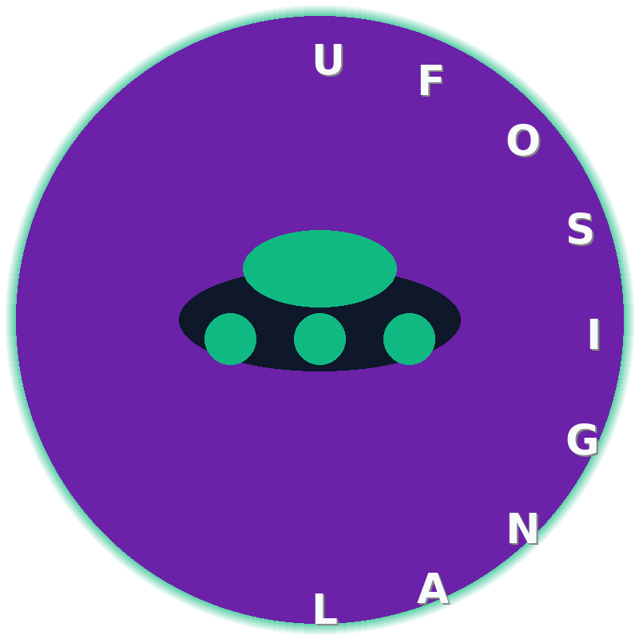

# 🚀 UFOSIGNAL - PACKAGE COMPLETO CANALE YOUTUBE UFO

<p align="center">
  
</p>

> **Oltre l'orizzonte, qualcosa ci osserva** 📡

---

## 📋 DESCRIZIONE

Questo repository contiene il pacchetto completo per creare e gestire il canale YouTube **UFOSIGNAL** - il canale italiano #1 dedicato agli UFO, avvistamenti alieni e fenomeni anomali non identificati (UAP).

### 🎯 Cosa include:

- ✅ Script video ottimizzato per Fliki
- ✅ SEO completa al 100% per YouTube
- ✅ Template thumbnail virali
- ✅ Keyword research (50+ keyword italiane)
- ✅ Analisi 30+ competitor
- ✅ Asset visivi (logo, banner, icone)
- ✅ Piano editoriale 8 mesi
- ✅ Guida step-by-step

---

## 📁 STRUTTURA REPOSITORY

```
ufosignal-content/
├── README.md                 # Questa guida
├── STEP-BY-STEP.md           # Istruzioni dettagliate
│
├── 📄 DOCUMENTAZIONE SEO
│   ├── UFO_SIGNAL_COMPLETE_PACKAGE.md   # Setup canale completo
│   ├── UFOSIGNAL_SEO_COMPLETE.md       # SEO sviluppata
│   ├── UFOSIGNAL_VIDEO_SEO_PACKAGE.md   # Script + thumbnail
│   │
│   ├── FLIKI_COMPLETE_PACKAGE.md        # Package Fliki completo
│   └── FLIKI_QUICK_REFERENCE.md         # Quick copy-paste
│
├── 🖼️ ASSET GRAFICI
│   └── assets/
│       ├── logo_ufosignal.png           # Logo principale (800x800)
│       ├── logo_icon.png               # Icona canale (200x200)
│       ├── banner_channel.jpg          # Banner canale (2560x1440)
│       └── thumbnail_template.jpg      # Template thumbnail
│
└── 🐍 SCRIPTS
    └── generate_ufo_assets.py          # Script Python per generare asset
```

---

## 🎬 STEP-BY-STEP: CREARE IL PRIMO VIDEO

### FASE 1: PREPARE FLIKI

1. **Apri [Fliki.ai](https://fliki.ai)**
2. **Login/Registrazione** con il tuo account
3. **Crea nuovo progetto** → "Video"

### FASE 2: CARICARE SCRIPT

1. **Apri** `FLIKI_QUICK_REFERENCE.md`
2. **Copia** tutta la sezione "SCRIPT VIDEO"
3. **Incolla** nella casella di Fliki "Script/Content"

### FASE 3: CONFIGURARE

```
🔧 IMPOSTAZIONI FLIKI:

📝 Content:
   - Lingua: ITALIANO 🇮🇹
   - Tipo: YOUTUBE VIDEO
   - Formato: 16:9 LANDSCAPE

🎙️ Voiceover:
   - Voce: DONNA ITALIANA
   - Es. "Chiara", "Elisa", "Francesca"
   - Velocità: Normale
   - Emozione: Misteriosa, Investigativa

🎵 Audio:
   - Stile: CINEMATIC / MYSTERIOUS
   - Colonna sonora: Hans Zimmer style

📊 Video Settings:
   - Durata: 8-10 minuti
   - Quality: HIGH (1080p)
```

### FASE 4: GENERARE VIDEO

1. **Clicca "Generate" o "Create Video"**
2. **Aspetta** 15-20 minuti per il rendering
3. **Scarica** il video in alta qualità (MP4)

### FASE 5: CARICARE SU YOUTUBE

1. **Vai su [YouTube Studio](https://studio.youtube.com)**
2. **Clicca "Crea"** → "Carica file video**
3. **Carica** il video MP4 generato da Fliki

### FASE 6: APPLICARE SEO

1. **APRI** `FLIKI_QUICK_REFERENCE.md`
2. **COPIA** la sezione "YOUTUBE SEO"
3. **INCOLLA** nel canale YouTube:

#### TITOLO (copia dal file):
```
10 AVVISTAMENTI UFO 2025 - Filmati che TI LASCIANO
```

#### DESCRIZIONE (copia dal file):
```
📡 UFOSIGNAL - Il tuo segnale verso l'infinito

In questo video ti mostro i 10 avvistamenti UFO più sorprendenti del 2025. Filmati reali, testimonianze e reazioni governative.

⏱️ TIMESTAMPS:
00:00 - HOOK: Il cielo sta cambiando
00:30 - Avvistamento #1: Ancona, Italia
02:00 - Avvistamenti #2-5: New York, Germania, Spagna, Australia
05:00 - Cosa dicono i governi
07:00 - La mia conclusione
08:30 - Iscriviti e attiva la campanella!

🔴 ISCRIVITI A UFOSIGNAL:
👉 https://www.youtube.com/channel/UC...@UFOSIGNAL
🔔 Attiva la campanella per non perdere nessun avvistamento!

#UFO #avvistamenti2025 #alieni #filmati #italia #mondo #mistero #ufologia
```

#### TAGS (copia dal file):
```
ufo avvistamento 2025, filmato alieno 2025, avvistamento italiano, alieni filmati, ufo triangolare, oggetto non identificato, uap, mistero cielo, ufologia, testimonianza ufo, filmato reale, governo ufo, nasa ufo, pentagono ufo, avvistamento recente, extraterrestre, notizie ufo, curiosità alieni, caso documentato, disclosure
```

### FASE 7: CARICARE THUMBNAIL

1. **Apri** `assets/thumbnail_template.jpg` 
2. **Oppure crea** la thumbnail con Canva/Photoshop usando le istruzioni in `UFOSIGNAL_SEO_COMPLETE.md`
3. **Carica** su YouTube

### FASE 8: PUBBLICARE

1. **Imposta** visibilità "Pubblico"
2. **Scegli** orario (16:00-18:00 Italia consigliato)
3. **Clicca "Pubblica"**

---

## 🎨 BRAND UFOSIGNAL

### COLORE BRAND
| Colore | Hex | Uso |
|--------|-----|-----|
| Viola Spaziale | `#6B21A8` | Sfondo, accenti |
| Verde Alieno | `#10B981` | Effetti glow, CTA |
| Arancione | `#F97316` | Alert, numeri |
| Blu Notte | `#0F172A` | Background |
| Bianco | `#F8FAFC` | Testo |

### LOGO
- **File:** `assets/logo_ufosignal.png`
- **Dimensioni:** 800x800 px
- **Formato:** PNG trasparente

### BANNER
- **File:** `assets/banner_channel.jpg`
- **Dimensioni:** 2560x1440 px
- **Zona sicura:** 1546x423 px (visibile su tutti i dispositivi)

---

## 🔍 SEO KEYWORD TARGET

### 🔥 KEYWORD ALTO VOLUME

| Keyword | Priorità |
|---------|----------|
| avvistamento ufo 2025 | ⭐⭐⭐⭐⭐ |
| filmato alieno | ⭐⭐⭐⭐⭐ |
| ufo italia | ⭐⭐⭐⭐ |
| alieni esistono | ⭐⭐⭐⭐ |
| ufo filmato | ⭐⭐⭐⭐ |

### 🟡 KEYWORD MEDIO VOLUME

| Keyword | Priorità |
|---------|----------|
| roswell 2025 | ⭐⭐⭐ |
| area 51 | ⭐⭐⭐ |
| nasa alieni | ⭐⭐⭐ |
| pentagono ufo | ⭐⭐⭐ |

Vedi `UFOSIGNAL_SEO_COMPLETE.md` per la lista completa (50+ keyword)

---

## 📅 PIANO EDITORIALE SUGGERITO

| Settimana | Video | Formato |
|-----------|-------|---------|
| 1 | 10 Avvistamenti UFO 2025 | Long 10min |
| 2 | UFO in Italia: casi principali | Long 12min |
| 3 | Breaking: nuovo avvistamento | Short 30s |
| 4 | Perché governo nasconde UFO | Long 15min |
| 5 | Roswell: verità nascosta | Long 15min |
| 6 | Top 5 piloti che hanno visto UFO | Long 10min |
| 7 | NASA: "Non siamo soli" | Short 45s |
| 8 | Analisi filmato virale | Long 12min |

---

## 🛠️ TOOL CONSIGLIATI

| Tool | Uso | Costo |
|------|-----|-------|
| **Fliki** | Generazione video AI | Freemium |
| **Canva** | Thumbnail, grafica | Freemium |
| **TubeBuddy** | SEO YouTube | Freemium |
| **VidIQ** | Analytics competitor | Freemium |
| **Capcut** | Editing video | Gratis |
| **ElevenLabs** | Voiceover premium | Pay |

---

## 📚 DOCUMENTAZIONE APPROFONDITA

| File | Contenuto |
|------|-----------|
| `STEP-BY-STEP.md` | Guida dettagliata passo-passo |
| `UFO_SIGNAL_COMPLETE_PACKAGE.md` | Setup completo canale + 30 competitor |
| `UFOSIGNAL_SEO_COMPLETE.md` | SEO sviluppata + keyword research |
| `UFOSIGNAL_VIDEO_SEO_PACKAGE.md` | Script video + 5 template thumbnail |
| `FLIKI_COMPLETE_PACKAGE.md` | Package completo per Fliki |
| `FLIKI_QUICK_REFERENCE.md` | Quick copy-paste per Fliki |

---

## 🤝 CONTRIBUTI

Questo è un progetto personale. Per domande o suggerimenti, apri una issue.

---

## 📄 LICENZA

MIT License - Libero uso per scopi educativi e di intrattenimento.

---

## 🔗 LINK UTILI

- [Fliki.ai](https://fliki.ai) - Generazione video
- [YouTube Studio](https://studio.youtube.com) - Gestione canale
- [Canva](https://canva.com) - Grafica thumbnail
- [TubeBuddy](https://tubebuddy.com) - SEO YouTube

---

<p align="center">
  <strong>📡 UFOSIGNAL - Il tuo segnale verso l'infinito 📡</strong>
</p>